# IPL Auction System - Design Documentation

This document provides a comprehensive overview of the IPL Auction System's architecture, design patterns, and implementation details.

---

## Table of Contents

1. [Architecture Overview](#architecture-overview)
2. [Event-Driven Architecture](#event-driven-architecture)
3. [Background Tasks Execution](#background-tasks-execution)
4. [WebSocket Implementation](#websocket-implementation)
5. [HTTP API Endpoints](#http-api-endpoints)
6. [Redis Data Structures](#redis-data-structures)
7. [State Management](#state-management)
8. [Observability](#observability)
9. [Database Schema](#database-schema)

---

## Architecture Overview

### High-Level System Architecture

```mermaid
graph TB
    Client[Web Client/Browser]
    
    subgraph "Axum Web Server :4545"
        Router[Axum Router]
        Auth[Auth Middleware]
        WS[WebSocket Handler]
        HTTP[HTTP Controllers]
        
        subgraph "Services Layer"
            AuctionLogic[Auction Logic Executor]
            AuctionRoom[Auction Room Service]
            BgTasks[Background Task Runners]
        end
        
        subgraph "State Management"
            AppState[AppState - In-Memory Rooms]
            TaskChannels[Tokio Channels]
        end
    end
    
    subgraph "Data Layer"
        Redis[(Redis Cache<br/>- Room State<br/>- Timers<br/>- Bids)]
        Postgres[(PostgreSQL<br/>- Users<br/>- Rooms<br/>- Players<br/>- Sold/Unsold)]
    end
    
    subgraph "Event System"
        RedisPubSub[Redis Keyspace<br/>Expiry Events]
    end
    
    subgraph "Observability"
        Metrics[Prometheus :9898]
        Tracing[Structured Logging]
    end
    
    Client <-->|HTTP/WS| Router
    Router --> Auth
    Auth --> WS
    Auth --> HTTP
    
    WS --> AuctionLogic
    WS --> AuctionRoom
    HTTP --> AuctionLogic
    
    AuctionLogic --> AppState
    AuctionRoom --> AppState
    AuctionLogic -.->|Enqueue Tasks| TaskChannels
    AuctionRoom -.->|Enqueue Tasks| TaskChannels
    
    TaskChannels --> BgTasks
    BgTasks --> Postgres
    
    AuctionRoom <-->|State CRUD| Redis
    AuctionLogic <-->|State CRUD| Redis
    
    Redis -.->|Keyspace Events| RedisPubSub
    RedisPubSub -.->|Timer Expiry| AuctionRoom
    
    HTTP --> Postgres
    
    Router --> Metrics
    Router --> Tracing
```



### Technology Stack

| Layer | Technology | Purpose |
|-------|------------|---------|
| **Web Framework** | Axum 0.8.6 | Async HTTP/WebSocket server |
| **Async Runtime** | Tokio 1.48.0 | Asynchronous task execution |
| **Database** | PostgreSQL (SQLx 0.8.6) | Persistent data storage |
| **Cache/State** | Redis 0.32.7 | In-memory state, pub/sub events |
| **Serialization** | Serde 1.0.228 | JSON serialization |
| **Logging** | Tracing 0.1.41 | Structured logging |
| **Auth** | JsonWebToken 10.2.0 | JWT-based authentication |
| **Metrics** | Prometheus | Application metrics |
| **CORS** | tower-http | Cross-origin resource sharing |

### Component Interactions

The system follows a layered architecture:

1. **Presentation Layer**: HTTP routes and WebSocket endpoints
2. **Service Layer**: Business logic for auction operations
3. **Data Layer**: Redis for fast state access, PostgreSQL for persistence
4. **Background Layer**: Asynchronous task processors for DB operations

---

## Event-Driven Architecture

The system implements a sophisticated event-driven architecture using **Redis Keyspace Notifications** for timer-based auction mechanics.

### Redis Keyspace Events Configuration

Redis is configured with keyspace events enabled:
```
notify-keyspace-events Ex
```

This enables expiration events for keys with TTL.

### Timer-Based Auction Flow


### Event Listener Implementation

Located in [auction_room.rs:895](file:///home/phani/My/ipl_auction/src/services/auction_room.rs#L895-L919)

```rust
pub async fn listen_for_expiry_events(
    redis_url: &str, 
    app_state: &Arc<AppState>
) -> redis::RedisResult<()>
```

**Key Features:**
- Subscribes to Redis keyspace events: `__keyevent@0__:expired`
- Runs in a dedicated Tokio task spawned at application startup
- Auto-reconnects on connection failures (2-second retry interval)
- Filters events by timer key patterns:
  - `auction:timer:{room_id}` - Main bid timer
  - `auction:timer:rtms:{room_id}` - RTM (Right to Match) timer

### Timer Key Patterns

| Timer Key | Purpose | Expiry Duration |
|-----------|---------|-----------------|
| `auction:timer:{room_id}` | Main bid countdown | `BID_EXPIRY` env var (default: 30s) |
| `auction:timer:rtms:{room_id}` | RTM decision window | `BID_EXPIRY` env var |

### Expiry Event Handling

Located in [auction_room.rs:923](file:///home/phani/My/ipl_auction/src/services/auction_room.rs#L923-L1173)

**Main Bid Expiry Logic:**

1. **Retrieve current state** from Redis (bid, player, participants)
2. **Validate minimum participants** (3+ required)
3. **Process bid outcome**:
   - If `bid_amount > 0`: Mark player as sold
   - If `bid_amount == 0`: Mark player as unsold
4. **Update state**:
   - Update winner's balance and player count
   - Enqueue background DB tasks
5. **Fetch next player** and broadcast
6. **Check completion** or pause conditions

**RTM Expiry Logic:**
- Validates RTM usage
- Awards player to RTM user at current bid
- Resets timers and continues auction

### Event-Driven Benefits

- **Non-blocking**: Bid timers run independently without blocking WebSocket connections
- **Scalable**: Redis handles timer state across multiple server instances
- **Reliable**: Expiry events guaranteed even if application restarts
- **Decoupled**: Timer logic separated from WebSocket message handling

---

## Background Tasks Execution

The system uses **Tokio unbounded channels** to offload database operations to background workers, keeping WebSocket handlers responsive.

### Architecture


### Channel Initialization

Located in [main.rs:65-66](file:///home/phani/My/ipl_auction/src/main.rs#L65-L66)

```rust
let (tx, mut rx) = mpsc::unbounded_channel::<DBCommandsAuctionRoom>();
let (tx_outside_auction_d, mut rx_outside_auction_d) = mpsc::unbounded_channel::<DBCommandsAuction>();
```

Channels are stored in `AppState` and spawned as background tasks:
- [main.rs:93-95](file:///home/phani/My/ipl_auction/src/main.rs#L93-L95) - Auction room task executor
- [main.rs:98-100](file:///home/phani/My/ipl_auction/src/main.rs#L98-L100) - External task executor

### Background Task Types

#### Auction Room Tasks (`DBCommandsAuctionRoom`)

Defined in [background_db_tasks.rs:32-39](file:///home/phani/My/ipl_auction/src/models/background_db_tasks.rs#L32-L39)

```rust
pub enum DBCommandsAuctionRoom {
    UpdateRemainingRTMS(ParticipantId),
    PlayerSold(SoldPlayer),
    PlayerUnSold(UnSoldPlayer),
    BalanceUpdate(BalanceUpdate),
    UpdateRoomStatus(RoomStatus),
    CompletedRoom(CompletedRoom),
}
```

**Task Descriptions:**

| Task | Triggered By | Database Operation |
|------|--------------|-------------------|
| `UpdateRemainingRTMS` | RTM usage | Decrement participant's remaining RTM count |
| `PlayerSold` | Bid timer expiry (with bid) | Insert into `sold_players` table |
| `PlayerUnSold` | Bid timer expiry (no bid) | Insert into `unsold_players` table |
| `BalanceUpdate` | Player sold | Update participant's `remaining_balance` |
| `UpdateRoomStatus` | Auction start/end | Update room `status` field |
| `CompletedRoom` | Auction completion | Move data to completed tables, cleanup |

#### External Tasks (`DBCommandsAuction`)

Defined in [background_db_tasks.rs:51-54](file:///home/phani/My/ipl_auction/src/models/background_db_tasks.rs#L51-L54)

```rust
pub enum DBCommandsAuction {
    AddUserExternalDetails(UserExternalDetails),
    FavoriteTeamUpdated(FavoriteTeamUpdated),
}
```

**Task Descriptions:**

| Task | Triggered By | Database Operation |
|------|--------------|-------------------|
| `AddUserExternalDetails` | User login | Fetch geo-location from IP, store in DB |
| `FavoriteTeamUpdated` | Profile update | Log favorite team change |

### Background Worker Implementation

#### Auction Room Worker

Located in [background_db_tasks_runner.rs:6-70](file:///home/phani/My/ipl_auction/src/services/background_db_tasks_runner.rs#L6-L70)

```rust
pub async fn background_tasks_executor(
    app_state: Arc<AppState>, 
    mut rx: tokio::sync::mpsc::UnboundedReceiver<DBCommandsAuctionRoom>
)
```

**Processing Flow:**
1. Continuously receives tasks from channel
2. Pattern matches on task type
3. Executes corresponding database operation
4. Logs success/failure (errors logged, no retry logic currently)

#### External Worker

Located in [background_db_tasks_runner.rs:73-105](file:///home/phani/My/ipl_auction/src/services/background_db_tasks_runner.rs#L73-L105)

Handles non-auction tasks like geo-location API calls for user tracking.

### Example: Player Sold Flow


### Benefits

- **Non-blocking**: WebSocket responses sent immediately
- **Fault tolerance**: Failed DB writes logged, don't crash auction
- **Separation of concerns**: Business logic decoupled from persistence
- **Performance**: Auction critical path optimized for latency

---

## WebSocket Implementation

### Connection Endpoint

**Route:** `GET /ws/{room_id}/{participant_id}`

Located in [auction.rs:17-19](file:///home/phani/My/ipl_auction/src/auction.rs#L17-L19)

### Connection Flow


### Client-to-Server Messages

Complete reference in [api_specs.md](file:///home/phani/My/ipl_auction/api_specs.md#L427-L505)

| Message | Description | Handler Location |
|---------|-------------|------------------|
| `start` | Start auction (creator only) | [auction_logic_executor.rs:12](file:///home/phani/My/ipl_auction/src/services/auction_logic_executor.rs#L12-L103) |
| `bid` | Place bid on current player | [auction_logic_executor.rs:106](file:///home/phani/My/ipl_auction/src/services/auction_logic_executor.rs#L106-L194) |
| `skip` | Skip current player | [auction_logic_executor.rs:198](file:///home/phani/My/ipl_auction/src/services/auction_logic_executor.rs#L198-L260) |
| `end` | End auction (creator only) | [auction.rs:340](file:///home/phani/My/ipl_auction/src/auction.rs#L340-L410) |
| `pause` | Pause auction (creator only) | [auction.rs:412](file:///home/phani/My/ipl_auction/src/auction.rs#L412-L430) |
| `rtm` | Use Right to Match | [auction_logic_executor.rs:306](file:///home/phani/My/ipl_auction/src/services/auction_logic_executor.rs#L306-L394) |
| `rtm-accept` | Accept RTM bid | [auction.rs:432](file:///home/phani/My/ipl_auction/src/auction.rs#L432-L453) |
| `rtm-cancel` | Cancel RTM | [auction_logic_executor.rs:284](file:///home/phani/My/ipl_auction/src/services/auction_logic_executor.rs#L284-L303) |
| `instant-rtm-cancel` | Instant RTM cancel | [auction_logic_executor.rs:263](file:///home/phani/My/ipl_auction/src/services/auction_logic_executor.rs#L263-L281) |
| `skip-current-pool` | Vote to skip player pool | [auction.rs:493](file:///home/phani/My/ipl_auction/src/auction.rs#L493-L510) |
| `get-is-skipped-pool` | Check if user voted skip | [auction.rs:512](file:///home/phani/My/ipl_auction/src/auction.rs#L512-L527) |
| `mute` / `unmute` | Toggle audio state | [auction.rs:313](file:///home/phani/My/ipl_auction/src/auction.rs#L313-L329) |
| `ping` | Heartbeat | [auction.rs:309](file:///home/phani/My/ipl_auction/src/auction.rs#L309-L312) |
| `chat-{msg}` | Send chat message | [auction.rs:473](file:///home/phani/My/ipl_auction/src/auction.rs#L473-L491) |
| WebRTC signals | Offer/Answer/ICE | [auction.rs:538](file:///home/phani/My/ipl_auction/src/auction.rs#L538-L574) |

### Server-to-Client Messages

Complete reference in [api_specs.md](file:///home/phani/My/ipl_auction/api_specs.md#L508-L700)

| Message Type | Format | Sent When |
|--------------|--------|-----------|
| New Participant | JSON: `{participant_id, team_name, balance}` | User joins |
| Participant Reconnect | JSON: `{id, team_name, balance, total_players_brought}` | User reconnects |
| Player Up for Auction | JSON: `{id, name, base_price, country, role}` | New player |
| Bid Placed | JSON: `{team, bid_amount}` | Valid bid |
| Player Sold | JSON: `{team_name, sold_price, remaining_balance}` | Timer expires (with bid) |
| Player Unsold | Text: `"UnSold"` | Timer expires (no bid) |
| Auction Completed | Text: `"Auction Completed"` | No more players |
| Exit Signal | Text: `"exit"` | Auction ended by creator |
| Error Messages | Text: Various | Validation failures |

### Message Broadcasting

Located in [auction.rs:626-637](file:///home/phani/My/ipl_auction/src/auction.rs#L626-L637)

```rust
pub async fn broadcast_handler(msg: Message, room_id: &str, state: &AppState)
```

Sends message to all participants in a room via in-memory channel lookup.

### Room State Management

**In-Memory Structure:**
```rust
// AppState.rooms
Arc<RwLock<HashMap<String, Vec<(i32, UnboundedSender<Message>)>>>>
```

- **Key**: `room_id`
- **Value**: Vector of `(participant_id, message_sender)` tuples
- Protected by async read-write lock
- Cleaned up on disconnection

## Future Horizontal Scaling
WebSocket Horizontal Scaling Using Pub/Sub / Message Brokers

To support horizontal scaling and handle high concurrent participation, the application is designed to run multiple WebSocket servers behind a load balancer. Each WebSocket server maintains only the connections that are directly established with it and does not depend on other servers’ in-memory state.

Participants connected to a single auction room may be distributed across multiple WebSocket servers. For example, in a setup with three WebSocket servers, participants P1–P5 may be connected to Server-1, P6–P8 to Server-2, and the remaining participants to Server-3. Each server tracks only its locally connected participants for a given room.

When a participant sends a message (such as placing a bid), the message is first received by the WebSocket server handling that participant’s connection. Instead of directly broadcasting the message to other WebSocket servers, the server publishes the event to a centralized messaging layer such as Redis Pub/Sub, Kafka, or RabbitMQ.

All WebSocket servers subscribe to relevant room-level events from the messaging layer. Upon receiving an event, each server independently fans out the message to the participants connected to that server for the corresponding room. This ensures that all participants in the room receive real-time updates, regardless of which WebSocket server they are connected to.

This architecture keeps WebSocket servers stateless with respect to auction logic and room ownership, enables seamless horizontal scaling, and ensures fault tolerance. If a WebSocket server fails, only its active connections are affected, while the auction state and event propagation remain intact through the centralized messaging system.

#### Each WS server manages only its own connections; Pub/Sub ensures all servers react to room events and fan-out updates locally.

---

## HTTP API Endpoints

Complete API documentation: [api_specs.md](file:///home/phani/My/ipl_auction/api_specs.md)

### Authentication

| Endpoint | Method | Description | Auth Required |
|----------|--------|-------------|---------------|
| `/continue-with-google` | POST | Google OAuth login | No |
| `/update-favorite-team/{new_team}` | GET | Update favorite team | Yes |

**Controllers:** [authentication.rs](file:///home/phani/My/ipl_auction/src/controllers/authentication.rs), [profile.rs](file:///home/phani/My/ipl_auction/src/controllers/profile.rs)

### Room Management

| Endpoint | Method | Description | Auth Required |
|----------|--------|-------------|---------------|
| `/rooms/create-room/{team_name}` | GET | Create auction room | Yes |
| `/rooms/join-room-get-teams/{room_id}` | GET | Get available teams | Yes |
| `/rooms/join-room/{room_id}/{team_name}` | GET | Join room with team | Yes |
| `/rooms/get-auctions-played` | GET | List user's rooms | Yes |
| `/rooms/get-participants/{room_id}` | GET | List room participants | Yes |

**Controllers:** [rooms.rs](file:///home/phani/My/ipl_auction/src/controllers/rooms.rs)

### Player Operations

| Endpoint | Method | Description | Auth Required |
|----------|--------|-------------|---------------|
| `/players/get-team-details/{participant_id}` | GET | Get team stats | Yes |
| `/players/get-team-players/{participant_id}` | GET | Get team roster | Yes |

**Controllers:** [player.rs](file:///home/phani/My/ipl_auction/src/controllers/player.rs)

### Admin Routes

Located in [admin_routes.rs](file:///home/phani/My/ipl_auction/src/routes/admin_routes.rs)

Admin endpoints for system management (authentication details in controller).

### Other Endpoints

| Endpoint | Method | Description | Auth Required |
|----------|--------|-------------|---------------|
| `/feedback` | POST | Submit feedback | Yes |
| `/health` | GET | Health check | No |

**Controllers:** [others.rs](file:///home/phani/My/ipl_auction/src/controllers/others.rs)

### Middleware

**Authentication Middleware:** [authentication.rs](file:///home/phani/My/ipl_auction/src/middlewares/authentication.rs)

- Validates JWT tokens in `Authorization: Bearer {token}` header
- Extracts user ID from claims
- Injects user context into request extensions

---

## Redis Data Structures

### Room Metadata

**Key:** `auction:room:{room_id}:meta`  
**Type:** Hash  
**Fields:**
```
room_creator_id: i32
pause: bool
```

### Participant Data

**Key:** `auction:room:{room_id}:participant:{participant_id}`  
**Type:** Hash  
**Fields:**
```
id: i32
team_name: String
balance: f32
total_players_brought: u8
remaining_rtms: u8
is_unmuted: bool
foreign_players_brought: u8
```

### Current Player

**Key:** `auction:room:{room_id}:current_player`  
**Type:** Hash  
**Fields:**
```
id: i32
name: String
base_price: f32
country: String
role: String
```

### Current Bid

**Key:** `auction:room:{room_id}:current_bid`  
**Type:** Hash  
**Fields:**
```
participant_id: i32
player_id: i32
bid_amount: f32
base_price: f32
bid_incremented: bool
rtm_used: bool
```

### Timer Keys

| Key Pattern | Type | Purpose | TTL |
|-------------|------|---------|-----|
| `auction:timer:{room_id}` | String | Bid countdown | `BID_EXPIRY` |
| `auction:timer:rtms:{room_id}` | String | RTM decision window | `BID_EXPIRY` |

### Skip Tracking

**Skip Current Player:**
- **Key:** `auction:room:{room_id}:skip:{participant_id}`
- **Type:** String
- **Value:** "1"

**Skip Pool Vote:**
- **Key:** `auction:room:{room_id}:skipped_pool:{participant_id}`
- **Type:** String
- **Value:** "1"

**Pool Skip Count:**
- **Key:** `auction:room:{room_id}:skipped_pool_count`
- **Type:** String
- **Value:** count as string

### Participant List

**Key:** `auction:room:{room_id}:participants`  
**Type:** Set  
**Members:** Participant IDs (strings)

### Player Pool Management

All players are pre-loaded into Redis on application startup.

**Global Players:**
- **Key:** `players:all:{player_id}`
- **Type:** Hash
- **Fields:** Player details (name, role, country, base_price, pool_no)

**Pool Index:**
- **Key:** `players:pool:{pool_no}`
- **Type:** Sorted Set
- **Score:** Player ID
- **Purpose:** Fast retrieval of players by pool

---

## State Management

### Three-Layer State Architecture


### AppState Structure

Defined in [app_state.rs](file:///home/phani/My/ipl_auction/src/models/app_state.rs)

```rust
pub struct AppState {
    pub rooms: Arc<RwLock<HashMap<String, Vec<(i32, UnboundedSender<Message>)>>>>,
    pub database_connection: Arc<DatabaseAccess>,
    pub auction_room_database_task_executor: UnboundedSender<DBCommandsAuctionRoom>,
    pub database_task_executor: UnboundedSender<DBCommandsAuction>,
    pub redis_connection: Arc<RedisConnection>,
}
```

### Synchronization Strategy

1. **Read Path:**
   - WebSocket handlers read from Redis
   - HTTP endpoints read from PostgreSQL
   - No read-through caching (Redis is source of truth during auction)

2. **Write Path:**
   - Critical updates: Immediate Redis writes
   - Persistence: Background tasks to PostgreSQL
   - On completion: Redis data moved to PostgreSQL completed tables

3. **Consistency:**
   - Redis state cleared on auction completion
   - PostgreSQL remains authoritative for historical data
   - No distributed transaction coordination (eventual consistency model)

---

## Observability

### Structured Logging

**Implementation:** [tracing.rs](file:///home/phani/My/ipl_auction/src/observability/tracing.rs)

- **Library:** `tracing` + `tracing-subscriber`
- **Format:** JSON structured logs
- **Output:** Asynchronous non-blocking file appender
- **Levels:** info, warn, error, debug, trace

**Instrumentation Example:**
```rust
#[tracing::instrument(
    name = "bid_allowance_handler",
    fields(current_bid, balance, total_players_brought, strict_mode)
)]
```

### Metrics Collection

**Implementation:** [metrics.rs](file:///home/phani/My/ipl_auction/src/observability/metrics.rs)

- **Endpoint:** `:9898/metrics` (Prometheus format)
- **Metrics:**
  - Custom counters for bid events
  - HTTP request metrics
  - WebSocket connection counts

**Monitoring Stack:**
- **Prometheus:** Scrapes `:9898/metrics`
- **Grafana:** Dashboards on `:3000`

### HTTP Request Tracing

**Implementation:** [http_tracing.rs](file:///home/phani/My/ipl_auction/src/observability/http_tracing.rs)

- Middleware layer for all HTTP requests
- Logs: method, path, status code, duration
- Request ID tracking

### Ports Overview

| Port | Service | Purpose |
|------|---------|---------|
| 4545 | IPL Auction App | Main application |
| 9898 | Metrics Endpoint | Prometheus scraping |
| 9090 | Prometheus | Metrics aggregation |
| 3000 | Grafana | Visualization |

---

## Database Schema

### Core Tables

**users**
- `id` (PK)
- `gmail`
- `google_sid`
- `favorite_team`
- `created_at`

**rooms**
- `room_id` (PK, UUID)
- `created_by` (FK → users.id)
- `status` (not_started, in_progress, completed)
- `created_at`
- `completed_at`
- `room_mode` (bool - strict mode flag)

**participants**
- `id` (PK)
- `room_id` (FK → rooms.room_id)
- `user_id` (FK → users.id)
- `team_selected`
- `remaining_balance`
- `remaining_rtms`

**players**
- `id` (PK)
- `name`
- `role` (Batsman, Bowler, All Rounder, Wicket Keeper)
- `country`
- `base_price`
- `pool_no`

**sold_players**
- `room_id` (FK → rooms.room_id)
- `player_id` (FK → players.id)
- `participant_id` (FK → participants.id)
- `brought_price`

**unsold_players**
- `room_id` (FK → rooms.room_id)
- `player_id` (FK → players.id)

### Completed Room Tables

**completed_rooms_sold_players**
- Archive of sold players from finished auctions

**completed_rooms_unsold_players**
- Archive of unsold players from finished auctions

### Migrations

Located in `/migrations` directory:
- [0000001_up.sql](file:///home/phani/My/ipl_auction/migrations/0000001_up.sql)
- [0000002_up.sql](file:///home/phani/My/ipl_auction/migrations/0000002_up.sql)
- [ipl_auction_schema.sql](file:///home/phani/My/ipl_auction/migrations/ipl_auction_schema.sql)

---

## Additional Documentation

- **API Specifications:** [api_specs.md](file:///home/phani/My/ipl_auction/api_specs.md)
- **Frontend Specifications:** [frontend_spec.md](file:///home/phani/My/ipl_auction/frontend_spec.md)
- **Setup Instructions:** [README.md](file:///home/phani/My/ipl_auction/README.md)

---

**Document Version:** 1.0  
**Last Updated:** December 30, 2025  
**Author:** Guttikonda Phanidhar Reddy
